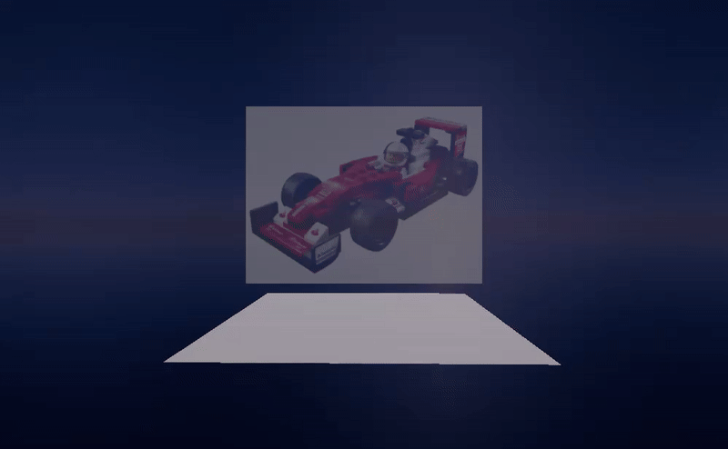
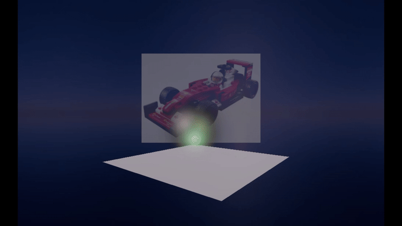
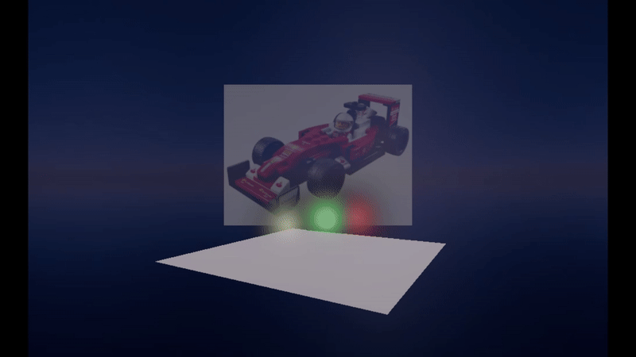
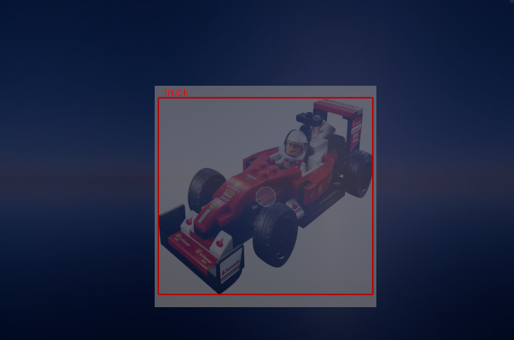

> :information_source: **Note:** This is just a suite of interfaces for discussion - no plugin code is provided. Don't clone it, it won't work!

# Unity XR AI Accelerator Library

This is an API for various AI Model pipelines for use in Unity XR prototypes. Plugin providers can implement this API to expose their models via a standard interface.

The intention is to provide a simplified API for building XR prototypes in Unity.

This initial proof of concept has a small selection of AI Model pipelines:

* ImageToText
* ImageToModel
* ObjectDetection

Note that these are one-shot model pipelines - not conversational LLMs.

The following plugins are provided:

* ImageToText
    * Groq
* ImageToModel
    * TripoAI
    * StableAI
* ObjectDetection
    * Sentis YOLO11

## Example

The `XrAiFactory` class manages plugins and fetches models by name.

For example, to fetch the Groq ImageToText model, load it by name '`Groq`' and pass your `apiKey` inside the `options`:

```
IXrAiImageToText imageToText = 
  XrAiFactory.LoadImageToText("Groq", new 
    System.Collections.Generic.Dictionary<string, string> {
        { "apiKey", _apiKey }
    }
);
```

Now execute the pipeline, passing in any model specific options (Groq requires a model and a prompt):

```
_task = imageToText.Execute(_rawImage.texture as Texture2D,
    new System.Collections.Generic.Dictionary<string, string>
    {
        { "model", "llama-4-scout-17b-16e-instruct" },
        { "prompt", "What's in this image?" }
    }
);
```

This is an asynchronous call that runs in the background. Check its progress in the `Update()` method:

```
if (_task != null)
{
    if (!_task.IsCompleted) return;

    if (_task.IsFaulted)
    {
        Debug.LogError("Task failed: " + _task.Exception);
        return;
    }

    XrAiTaskResult result = _task.Result;
    Debug.Log($"Answer: {result.StringResult}");
}
```

The `XrAiTaskResult` class supports multiple pipeline outputs - such as `string` for text results and `byte[]` for image results.

**To switch to another model plugin - change the name and the model specific options. The rest remains the same.**

## Model Pipelines

The plugin samples demonstrate that models can be provided via remote API calls or can run locally via Sentis. This is largely transparent in the API calls and developers can switch between plugins seamlessly.

**ImageToText** pipelines are relatively straight-forward - the plugin determines how to convert the texture to the required format and returns the text.

**ImageToModel** pipelines are more complex - TripoAI requires multiple HTTPS calls and this plugin returns OBJ models whereas StableAI is simpler but returns GLTF. Helper classes are provided that support conversion into GameObjects.

**ObjectDetection** pipelines can vary - this Yolo11 plugin is implemented to demonstrate that Sentis/Inference Engine is compatible with the API.

## Helpers

Helpers are important to simplify the input and output of various models:

* `XrAiGLTFHelper` converts GLTF model `byte[]` output into a `GameObject`.
* `XrAiOBJHelper` converts OBJ model `byte[]` output into a `GameObject`.
* `XrAiObjectDetectorHelper` draws bounding boxes based on the `ObjectDetector` output.

## In Action

The following Unity screenshows demonstrate the API in action.

| | |
|-|-|
|Groq Image To Text |StableAI Image To Model|
|TripoAI Image To Model |Yolo11 Object Detection |
